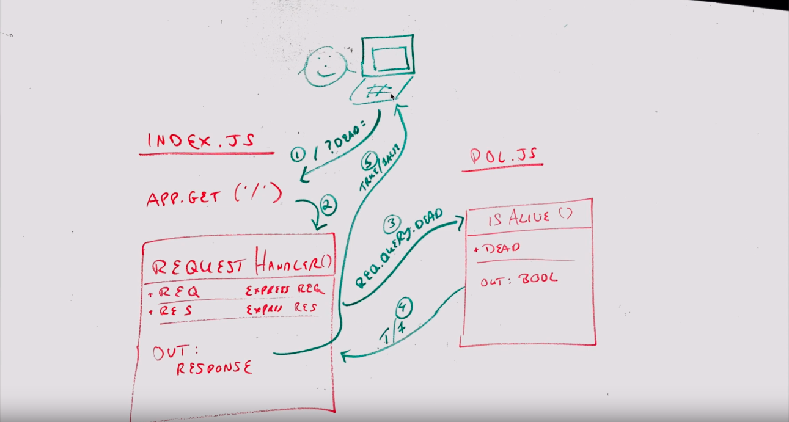

# LAB - 05

## Proof of Life Server

### Author: Evan Brecht-Curry

### Links and Resources
* [submission PR](https://github.com/evan-401-advanced-javascript/lab-5-deployment/pulls)
* [travis](https://www.travis-ci.com/evan-401-advanced-javascript/lab-5-deployment)
* [front-end](http://xyz.com) (https://evan-lab-5.herokuapp.com/)

#### Documentation
* [jsdoc](https://evan-lab-5.herokuapp.com/docs/) (Server assignments)

### Modules
#### `pol.js`
##### Exported Values and Methods

###### `isAlive(dead) -> boolean`
Returns true/false to indicate if the server is working.

###### `bar(array) -> array`
Usage Notes or examples

### Setup
#### `.env` requirements
* `PORT` - 3000
* `MONGODB_URI` - URL to the running mongo instance/db

#### Running the app
* `npm start`
* Endpoint: `/f`
  * Returns a boolean.
* Endpoint: `/docs`
  * Returns JS docs.
  
#### Tests
* Unit Tests: 'npm test'
* Lint Tests: 'npm run lint'

#### UML
